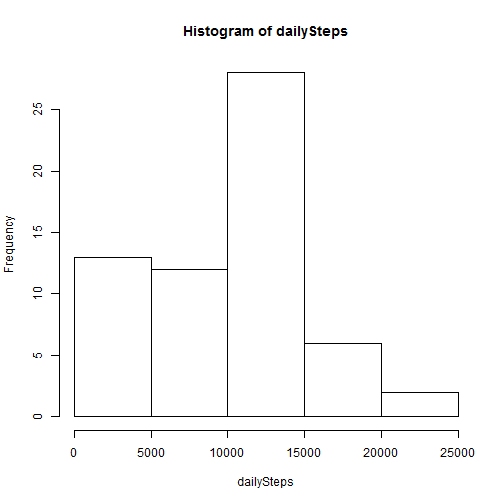
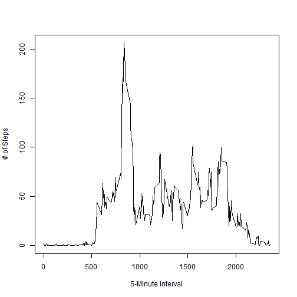
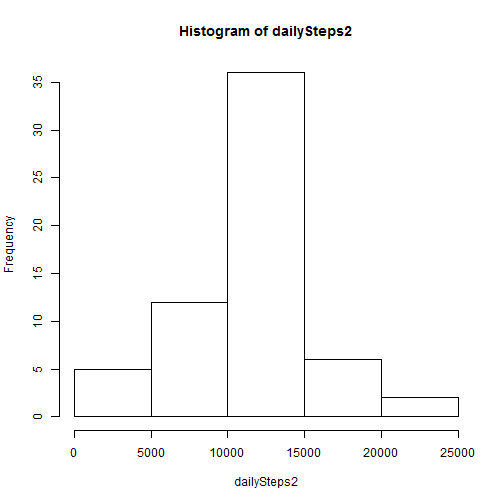

Peer Assignment 1 
=============================

```r
setwd("C:/Users/ece.o/OneDrive/Coursera/Johns Hopkins University Data Science/Reproducible Research/RepData_PeerAssessment1")
```

## Loading and preprocessing the data

```r
data <- read.csv("activity.csv")
```

## What is mean total number of steps taken per day?
1. Total number of steps taken per day

```r
dailySteps <- tapply(data[,1], data[,2], sum, na.rm = TRUE)
```

2. Histogram of the total number of steps taken each day

```r
hist(dailySteps)
```

 

3. Mean of the total number of steps taken per day is 9354 and median is 10395

## What is the average daily activity pattern?
1. Time series plot of the 5-minute interval and the average number of steps taken, averaged across all days

```r
intSteps <- tapply(data[,1], data[,3], mean, na.rm = TRUE)
plot(names(intSteps), intSteps, type = "l", xlab = "5-Minute Interval", ylab = "# of Steps")
```

 

2. Interval 835 contains the maximum number of steps.

## Imputing missing values
1. The total number of rows with NAs is 2304.
2. Fill missing data with interval mean

```r
filled <- data
for (i in 1:nrow(filled)) {
  if (is.na(data[i,1])) {
    filled[i, 1] = intSteps[names(intSteps) == filled[i, 3]]
  }
}
```
4. 

```r
dailySteps2 <- tapply(filled[,1], filled[,2], sum)
hist(dailySteps2)
```

 

Mean of the total number of steps taken per day is 10766 and median is 10766, too.

The frequencies in the middle part of the histogram increased because the empty values are now replaced with average values. The mean and median are slightly higher, but not too high that can distort the analysis in a bad way.

## Are there differences in activity patterns between weekdays and weekends?
1. Convert to PosIX first, then apply `weekdays()`.

```r
filled$weekday <- as.factor(weekdays(as.POSIXct(filled[,2])))
filled$weekDE <- ifelse((filled[,4] == "Saturday") | (filled[,4] == "Sunday"), "weekend", "weekday")
filled$weekDE <- as.factor(filled$weekDE)
```

2. Group the data using `data.table`.

```r
library(data.table)
filled <- data.table(filled)
weekMean <- filled[, lapply(.SD, mean), by = "interval,weekDE"]
```

Create line chart.

```r
library(lattice)
xyplot(steps ~ interval|weekDE,
     data = weekMean,
     type = "l",
     xlab = "Interval",
     ylab = "Number of steps",
     layout=c(1,2))
```

 
